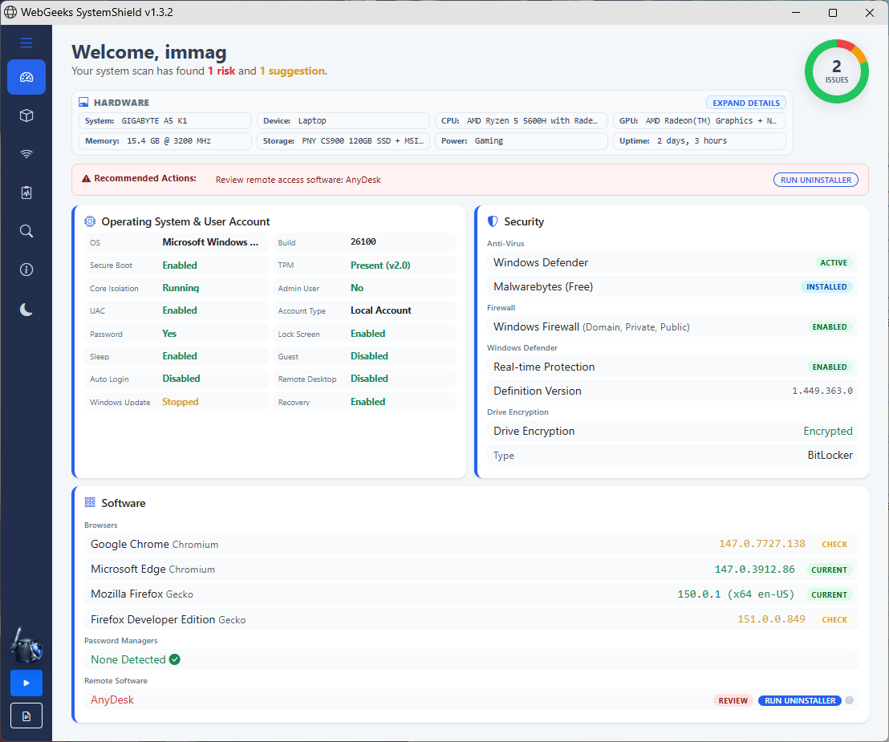
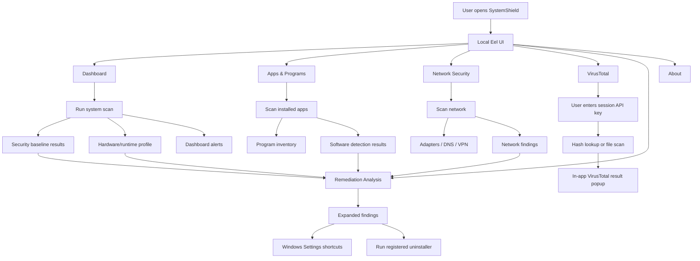
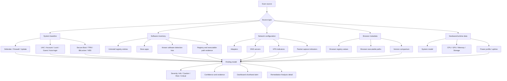

<h1 align="center"> WebGeeks SystemShield </h1>

<p align="center">
  
</p>

<p align="center">
  <strong>A lightweight home system security auditing tool for Windows 10/11.</strong>
</p>

<p align="center">
  <a href="https://systemshield.net">Website</a>
  ·
  <a href="https://github.com/ImmaGundam/WebGeeks-SystemShield/releases">Releases</a>
</p>

---

## Overview

**WebGeeks SystemShield** is a lightweight security and system auditing
application designed to help users understand what may be putting their
computer at risk.

SystemShield reviews system settings, installed software, browser versions,
network configuration, hardware/runtime information, and security features,
then presents the results in a clear browser-based dashboard with expanded
remediation guidance.

It is designed to help identify:

- Potentially unwanted programs, also known as PUPs
- Network sniffing and packet capture tools
- Remote access tools and exposed remote access settings
- Remote monitoring and management tools on unmanaged systems
- Misconfigured firewall, DNS, VPN, or network settings
- Outdated browsers and vulnerable software indicators
- Disabled or weakened system security features
- Long system uptime that may call for a proper restart

SystemShield is not an antivirus, malware remover, or endpoint protection
platform. It is a reporting and auditing tool that helps users review system
health, security posture, and configuration risks. SystemShield includes a
heuristic detection list focused on identifying common security and
configuration risks, including legitimate applications with known
vulnerabilities, potentially unwanted programs, capture & network software,
browser toolbars, junkware, remote access tools, RMM tools, and suspicious
utilities.

---

## Key Features

### System Security Review

- Detects Windows version, build, and system configuration
- Reviews Microsoft Defender status
- Checks firewall profile configuration
- Reports Windows Update status
- Reviews Secure Boot, TPM, BitLocker, and related system protections
- Evaluates user account, UAC, lock screen, guest account, and auto-login indicators

### Hardware & Runtime Profile

- Displays system manufacturer and model when available
- Displays device type when detectable
- Lists CPU, GPU, memory, storage, power profile, and uptime information
- Shows manufacturer and model values where Windows exposes them without administrator privileges
- Uses `Undetected` when a value cannot be safely read without elevated access

### Software & Browser Analysis

- Lists installed desktop programs
- Reviews Microsoft Store apps
- Detects known unwanted or risky software
- Detects remote access, RMM, packet capture, proxy, and related tools
- Checks installed browser versions
- Flags outdated, discontinued, or suspicious software indicators

### Network Configuration Review

- Displays Internet and VPN status in a compact overview
- Displays network adapter information in collapsed interface cards
- Reports local and public IP details
- Checks DNS configuration
- Detects possible DNS hijacking or DNS review indicators
- Identifies VPN usage and network-related anomalies
- Detects packet capture and interface dumping tools

### Remediation Analysis

- Builds a remediation profile from available scan sources
- Separates System, Software, and Network findings
- Shows the value found, evidence type, and detected path/registry/service data when available
- Provides plain-language explanations for each finding
- Uses Windows Settings shortcuts and Windows-registered uninstall entries for remediation guidance

### Risk Reporting

- Separates findings into risks and recommendations
- Provides shorthand dashboard alerts for quick review
- Provides expanded remediation details on the Remediation Analysis page
- Helps users understand what each issue means
- Generates audit-style PDF reports for documentation
- Apps & Programs report output defaults to the top 30 programs in the current sort order, with an option to include all detected programs

### VirusTotal Support

- Optional VirusTotal lookup support
- Hash-based file lookup support
- File upload support for additional analysis
- Displays lookup and scan results in an in-app result popup
- Uses the user's VirusTotal API key only for the current lookup session
- Does not save VirusTotal API keys to disk

> **Note:** VirusTotal lookups are controlled by the user's own VirusTotal API
> key and VirusTotal account terms. Do not upload private, confidential, or
> sensitive files unless you are permitted to submit them.

---

## Screenshots

| Page | Screenshot slot |
|---|---|
| Dashboard | Add: `docs/screenshots/dashboard.png` |
| Apps & Programs | Add: `docs/screenshots/apps-programs.png` |
| Apps & Programs | Add: `docs/screenshots/apps-programs2.png` |
| Network Security | Add: `docs/screenshots/network-security.png` |
| Remediation Analysis | Add: `docs/screenshots/remediation-analysis.png` |
| VirusTotal | Add: `docs/screenshots/virustotal.png` |
| VirusTotal 2 | Add: `docs/screenshots/virustotal2.png` |
| VirusTotal 3 | Add: `docs/screenshots/virustotal3.png` |
| About | Add: `docs/screenshots/about.png` |

Example image block:

```html
<p align="center">
  
</p>
```


## Project Structure

```text
WebGeeks-SystemShield/
├── .github/workflows/       # GitHub workflow files
├── docs/                    # Documentation and supporting files
├── web/                     # HTML, CSS, and JavaScript frontend
├── System_Scanner.py        # Main Python scanner application
├── detection_lists.py       # Detection lists and software indicators
├── logo.ico                 # Application icon
├── License.txt              # Project license
└── README.md                # Project overview
```

---

## Technology Stack

- **Python** — scanner logic and system checks
- **HTML/CSS/JavaScript** — local dashboard interface
- **Eel** — connects the Python backend to the web-based UI
- **PowerShell** — system-level Windows checks
- **PyInstaller** — standalone executable packaging

---

## What SystemShield Checks

SystemShield reviews several areas of system health and security:

| Area | Examples |
|---|---|
| Operating system | Version, build, update status |
| Security features | Defender, firewall, BitLocker, TPM, Secure Boot |
| User security | Account settings, password indicators, lock behavior |
| Hardware | System model, CPU, GPU, memory, storage, power profile, uptime |
| Software | Installed apps, PUP indicators, remote access tools, RMM tools |
| Browsers | Installed browsers and version status |
| Network | Internet/VPN overview, adapters, IP details, DNS, suspicious settings |
| Remediation | Windows Settings shortcuts, registered uninstall entries, guidance |
| Reporting | Risks, recommendations, remediation analysis, PDF export, top-30/all app report options |

---

## Detection Coverage

**Documentation snapshot:** v1.3.2 — 2026-04-30

SystemShield currently tracks **216 unique software/browser/tool names** across
its detection categories, plus **18 DNS review entries**.

| Detection group | Count |
|---|---:|
| PUP / bloatware | 17 |
| Scamware | 7 |
| Torrent / P2P clients | 10 |
| Crypto miners | 14 |
| Hacking / pentest utilities | 12 |
| Data transfer / exfil tools | 10 |
| Remote shell tools | 7 |
| RAT / malware frameworks | 14 |
| Credential stealers | 5 |
| VPN clients | 25 |
| Password managers | 16 |
| Remote access tools | 21 |
| RMM platforms | 10 |
| Packet capture / proxy tools | 8 |
| Browsers | 42 |

| Summary | Count |
|---|---:|
| Raw entries across categories | 218 |
| Unique software/browser/tool names | 216 |
| DNS review entries | 18 |

The duplicate cross-category entries are expected: `uTorrent` and
`Wireshark`. DNS review IPs are tracked separately from software detection.

---

## Remediation Model

SystemShield follows a guided remediation model:

```text
Scan → Detect Evidence → Compare Against Baseline → Explain → Guide Action
```

SystemShield does **not** remove files directly.

Software actions use Windows-registered uninstall entries or Windows Settings
shortcuts. This keeps remediation tied to Windows-native behavior instead of
custom destructive removal logic.

---

## Architecture Charts

Each chart is kept separate for readability. Use the full-size links to open the diagram source in its own page when the embedded GitHub preview is too small.

<details>
<summary>Application Flow Chart</summary>

[Open full-size diagram](docs/diagrams/application-flow.mmd)



</details>

<details>
<summary>Detection Logic Chart</summary>

[Open full-size diagram](docs/diagrams/detection-logic.mmd)



</details>

<details>
<summary>Function Reference Chart</summary>

[Open full-size diagram](docs/diagrams/function-reference.mmd)

```mermaid
flowchart TD
    A[System_Scanner.py] --> B[perform_scan]
    A --> C[get_programs]
    A --> D[get_network_info]
    A --> E[VirusTotal lookup functions]
    A --> F[Update checker]
    A --> G[Windows shortcut helpers]

    B --> B1[OS and baseline checks]
    B --> B2[Hardware/runtime collection]
    B --> B3[Browser detection]
    B --> B4[Remote/RMM/password-manager detection]

    C --> C1[Enumerate uninstall registry]
    C --> C2[Enumerate Store apps]
    C --> C3[Classify software source]
    C --> C4[Match software detection categories]

    D --> D1[DNS and adapter scan]
    D --> D2[VPN status]
    D --> D3[Wi-Fi security]
    D --> D4[SSH/Telnet and network indicators]

    E --> E1[Session API key only]
    E --> E2[Hash lookup]
    E --> E3[File scan]

    H[detection_lists.py] --> H1[Name-based lists]
    H --> H2[Registry/path lists]
    H --> H3[Browser metadata]
    H --> H4[DNS review entries]

    I[web/index.html + styles.css] --> I1[Dashboard rendering]
    I --> I2[Apps & Programs UI]
    I --> I3[Network UI]
    I --> I4[Remediation Analysis UI]
    I --> I5[VirusTotal UI]
    I --> I6[About / update UI]
```



</details>

---

## Important Notes

- SystemShield does not need administrator privileges for its main checks.
- Some values may show as `Undetected` when Windows does not expose them without elevated permissions or vendor-specific tools.
- SystemShield is designed for auditing, reporting, and Windows-based remediation guidance.
- It does not replace antivirus or endpoint protection software.
- It does not remove files directly.
- Software actions use Windows-registered uninstall entries or Windows Settings shortcuts.
- Results should be reviewed in context before making system changes.
- PDF reports use the current Apps & Programs sort order. Program output defaults to the top 30 entries unless the user enables all detected programs.
- VirusTotal functionality requires the user to provide their own API key.
- VirusTotal API keys are used only for the current lookup session and are not saved by SystemShield.
- This project is provided as freeware and is openly developed for
  transparency, documentation, and practical use.
- Use, redistribution, and modification are governed by the included
  `License.txt` file.

---

## How to Use

### Option 1: Standalone Executable

1. Go to the **Releases** page.
2. Download the latest compiled `.exe`.
3. Run SystemShield.
4. Start a scan from the dashboard.

No installation is required.

### Option 2: Run from Source

#### Requirements

- Windows 10 / Windows 11
- Python 3.x
- Run `System_Scanner.py`
  
#### Install dependencies

```bash
pip install eel psutil wmi pywin32
```

#### Run

```bash
python System_Scanner.py
```

---

## Roadmap

Future improvements:

- Expanded software detection lists
- Improved browser version detection
- More detailed remediation guidance
- Additional PDF/report formatting options
- Additional network configuration checks
- Optional installer packaging alongside portable builds

---

## License

See `License.txt` for license information.
